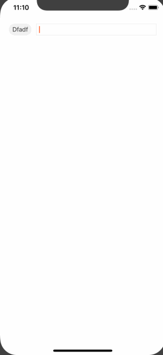
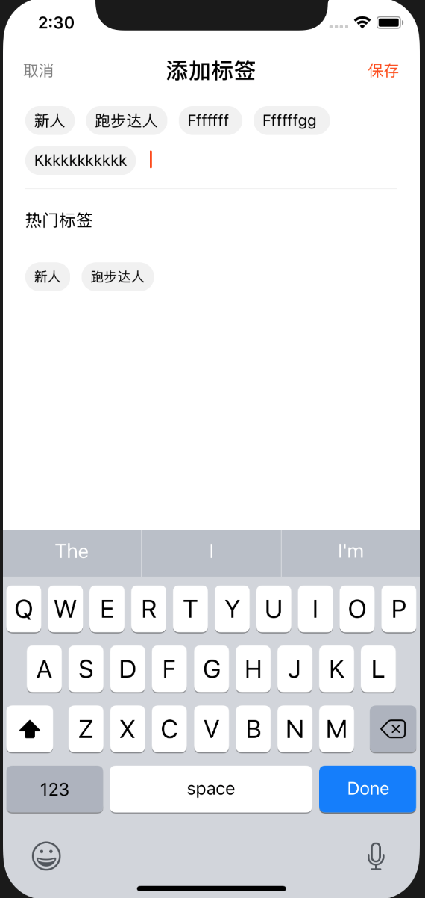

# react-native-label-inputview
###
react-native-label-inputview Support iOS & Android;

- [github](https://github.com/CJELLYS/react-native-label-inputview)

## Installation

```
npm i react-native-label-inputview --save

```




## Use
```
import LabelInputView from 'react-native-label-inputview'

export default class KeyBoardDismissView extends Component {
  render() {
    return (<View>
                <LabelInputView  
                labelMaxLimitNum={6}                 
                labelAry={this.state.labelAry} 
                addLabelAction = {this.addLabelAction.bind(this)}/>
      </View>
    );
  }
}
```

## Property&Function
```
LabelInputView.defaultProps = {
    labelAry: [],
    labelMaxLimitNum: 6,//限制最多有多少个标签
    popupWindowAction: f => f,//弹窗提示
    addLabelAction: f => f,// 添加标签到ary中.外界可以获取到
    labelWrapStyle: {},//label View style
    labelStyle:{},//label style
    labelTextStyle:{},//label title style
    autoFocus: true,// textInput autoFocus
    multiline: true,//textInput multiline
    selectionColor: '#FF4604',//textInput ios
    
}
```